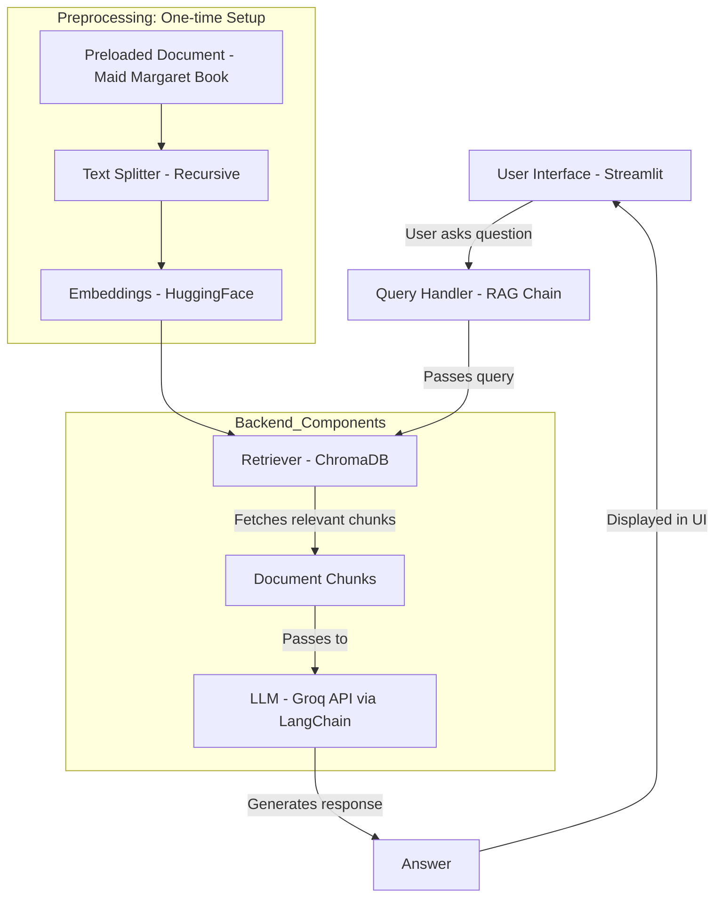
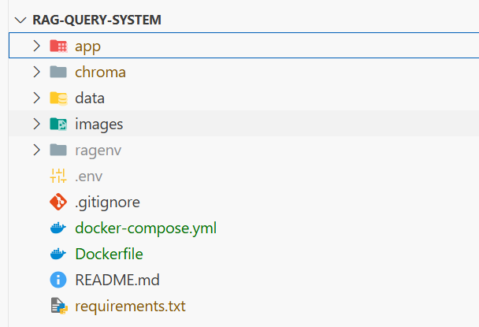

# Maid Margaret Q&A System (RAG App)

This project is a **Retrieval-Augmented Generation (RAG)** application built using **Streamlit**, **LangChain**, and **ChromaDB**. It allows users to ask questions about the historical book *"Maid Margaret of Galloway"*, and receive intelligent, source-aware answers powered by language models.

---
## Project Purpose

The purpose of this project is to develop an intelligent question-answering system that enables users to interact with a specific historical document; the *Maid Margaret of Galloway* book through a natural language interface. Traditional methods of exploring documents require readers to manually search for information, which can be time-consuming and inefficient, especially when dealing with long or complex texts. This system uses Retrieval-Augmented Generation (RAG) to bridge that gap by combining a fast and powerful language model (served via Groq API) with a local document retrieval system. Users can ask any question about the document through a clean, Streamlit-based interface, and receive accurate, context-aware answers.

The document chosen for this project, *Maid Margaret of Galloway*, is rich in historical and cultural content, making it an excellent candidate for demonstrating the capabilities of a RAG system. The text offers detailed biographical narratives, historical events, and social themes that invite deep exploration. However, such depth can be overwhelming for users looking for specific information. By using this book, the project showcases how AI can enhance access to heritage documents and make them more approachable to scholars, students, or history enthusiasts. The system preserves the integrity of the original content while enabling precise and meaningful interaction, helping users better understand the life, legacy, and historical context of *Maid Margaret* without needing to read the entire book.

---
## Architecture Overview



- The document Maid Margaret of Galloway is preprocessed during development, not uploaded by users.
- During this setup, the text is split into chunks using a recursive character text splitter and each chunk is converted into embeddings using a HuggingFace model. These  embeddings are stored in a ChromaDB instance locally.
- At runtime, the Streamlit UI accepts questions. A RetrievalQA chain fetches relevant chunks from ChromaDB based on the user's query. The Groq LLM processes the chunks and query to generate an accurate answer. The answer is displayed back in the Streamlit app.

---
## Chunking Strategy

- The book is preprocessed and split into **semantic chunks** using LangChain's default `RecursiveCharacterTextSplitter`.
- Each chunk is approximately **500 characters**, with an **overlap of 50**, to maintain context flow between chunks.

---
## Embedding Model

The default embedding model is:

- **Model Name**: `all-MiniLM-L6-v2`
- **Provider**: HuggingFace Sentence Transformers
- **Purpose**: Converts document chunks and queries into dense vectors for semantic search in Chroma.

---
## Getting Started (Local Setup)

### 1. Clone the Repository

```bash
git clone https://github.com/ninamitchell23/rag_query23.git
```

### 2. Set Environment Variables

Create a `.env` file at the project root:

```
GROQ_API_KEY=your_groq_api_key
GROQ_MODEL=llama3-8b-8192  # or your preferred Groq model
```

---

### 3. Build Docker Images

```bash
docker compose build
```

### 4. Run the Application Stack

```bash
docker compose up
```

### 5. Access the App

Once the app is running, open your browser and go to:

```
http://localhost:8501
```

You’ll see a clean UI where you can:
- Ask questions about *Maid Margaret*
- View past questions in the sidebar


##  Project Structure




##  Public Deployment

> **Live App:** 


## Acknowledgements

- [LangChain](https://github.com/langchain-ai/langchain)
- [Streamlit](https://streamlit.io)
- [Chroma](https://www.trychroma.com/)
- [HuggingFace Embeddings](https://huggingface.co/sentence-transformers/all-MiniLM-L6-v2)
- [Groq API](https://console.groq.com/)


## Future Improvements

- Add PDF upload support
- Advanced search filters (e.g., date, keyword)

---
> Built with ❤️ 
